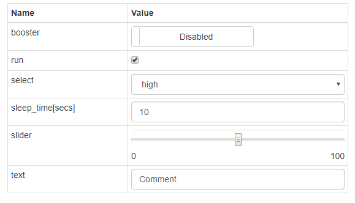

# BayEOS Python Device UI Module
Device web interface based on an observable Python dictionary

## Background
This module allows you to create a basic device web interface in just a few lines of code.
We developed it for our customers to check the state of a device and configure some main settings like switching a heating on and off or defining a target value like CO2 concentration.  

The module implements a typical model-view-controller pattern (MVC):

  + **Model:** Observable [ItemDictionary](bayeosdevice/item.py) to hold device state
  + **View:**: Dynamic generated web page for device values and settings
  + **Controller:** Asynchronous WebSocket event transport to push model change events to registered clients 


## Getting Started
### Prerequisites
- Python Runtime

### Installing on Linux 
- Import the repository key  
`wget -O - http://www.bayceer.uni-bayreuth.de/repos/apt/conf/bayceer_repo.gpg.key |apt-key add -`
- Add the following repository to /etc/apt/sources.list  
`deb http://www.bayceer.uni-bayreuth.de/repos/apt/debian stretch main`
- Update your repository cache  
`apt-get update`
- Install the package  
`apt-get install python-bayeosdevice`

### Installation on Windows
Install the package by a git clone request followed by a run of setup.py:
``` 
git clone git://github.com/BayCEER/python-bayeosdevice.git
cd python-bayeosdevice
python setup.py install
```

### Example Usage 
The following [script](docs/cpudevice.py) creates a new device to show the current CPU load on your pc.
```python
import time
import psutil

from bayeosdevice.device import DeviceController
from bayeosdevice.item import ItemDict

values = ItemDict({"cpu1":None})  
units = {"^cpu":'%',"\w+time$":'secs'}      
actions = ItemDict({"sleep_time":10, "run": True})        

con = DeviceController(values,actions,units)
con.start()

try:
    while True:  
        if (actions["run"] == True):
            cpu = psutil.cpu_percent(percpu=True)        
            values['cpu1'] = cpu[0]                                 
            time.sleep(actions["sleep_time"])            
        else:
            time.sleep(0.01)     
except KeyboardInterrupt:
    con.stop()
```

- Please run the script and open http://localhost in your browser
- Login with password: bayeos and navigate to the Values, Value Chart or Settings page.
- The UI is automatically refreshed whenever a value or setting is changed on the device.
- The __Values__ page shows your CPU loads:  

- Time series of all values are shown on the __Value Chart__ page:

- You can adapt the device settings on the __Settings__ page:  


The DeviceController can be customized by the following constructor arguments:

Argument|Description|Default
--------|-----------|--------
values| ItemDictionary for value page| Null
actions|ItemDictionary for settings page| Null
units| Dictionary for item units. Key can be a regular expression like '^cpu' to match all item keys that start with a 'cpu' string| {}
components| Dictionary to define controls on settings/action tab. Can be used to overwrite the default control based on action value types. Details are explained below.| {} 
configFile | Config file to save action values in python configparser format.| ""
port|Embedded web server port|80
password|Password|bayeos
template|Template file, used to render the device web page. File must be in folder 'bayeosdevice/templates'. A blueprint for a customized template can be found in file [custom.html](bayeosdevice/templates/custom.html)|items.html  

## User defined component elements
The controller can be initialized by a dictionary of component definitions: __{\<regex>:{'class':\<control>,'prop':\<prop>}}__
When the regular expression matches the action name, the component definition overwrites the default control.
A component definition is a dictionary with a class and a prop key. The optional prop key dictionary is used to define the state properties of the component. 

__Defintions__
```Python
{'class':'Text'} // Text as label
{'class':'TextInput'} // Text input
{'class':'NumberInput','prop':{min:0,'max':100,'step':1}} // Float and Integer input values 
{'class':'Slider','prop':{min:0,'max':100,'step':1}} // Slider 
{'class':'Select','prop':['option1','option2']}} 
{'class':'Toggle','prop':{text_on:'On','text_off':'Off','width':100}}
{'class':'CheckBox'}
```

__Sample__

```Python
# Example (formated for better readability)
actions = ItemDict(
    {
    'slider': 50, 
    'select': 'high',
    'run': True, 
    'booster':False,    
    'sleep_time':10.0,
    'text':'Comment', 
    }
)        

components =  {
    '^slider': {'class':'Slider','prop':{'min':0,'max':100,'step':10}}, 
    '^select': {'class':'Select','prop':['high','medium','low']},
    'run': {'class':'CheckBox'},
    'booster':{'class':'Toggle','prop':{'text_on':'Enabled','text_off':'Disabled','width':200}}
    }    

con = DeviceController(values,actions,units,components)
con.start()
```
__User defined components on settings tab:__



For more details and a running example see [cpu_device_b.py](docs/cpudevice_b.py)

## Authors 
* **Dr. Stefan Holzheu** - *Project lead* - [BayCEER, University of Bayreuth](https://www.bayceer.uni-bayreuth.de)
* **Oliver Archner** - *Programmer* - [BayCEER, University of Bayreuth](https://www.bayceer.uni-bayreuth.de)

## History
### Version 1.2.0, Apr 08, 2019
- New value chart tab based on [Highcharts](https://www.highcharts.com/)
### Version 1.1.3, Dec 06, 2018
- Fixed action value updates
### Version 1.1.1, Dec 05, 2018
- Fixed data type changes in NumberInput and CheckBox component
- Added validation messages for NumberInput
### Version 1.1.0, Nov 30, 2018
- #1 Autosave settings in file
- #2 User defined component elements
### Version 1.0.0, Dec 15, 2017
- Initial release
## License
GNU LESSER GENERAL PUBLIC LICENSE, Version 2.1, February 1999

