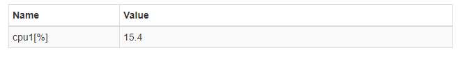

# BayEOS Python Device UI Module
Web interface based on an observable Python dictionary


- Model: Observable ItemDictionary to hold device state
- View: Dynamic generated web page for device values and settings
- Controller: Asynchronous WebSocket event transport to push events to registered clients 

## Getting Started
### Prerequisites
- Python Runtime

### Installing on Linux 
- Import the repository key  
`wget -O - http://www.bayceer.uni-bayreuth.de/repos/apt/conf/bayceer_repo.gpg.key |apt-key add -`
- Add the following repository to /etc/apt/sources.list  
`deb http://www.bayceer.uni-bayreuth.de/repos/apt/debian stretch main`
- Update your repository cache  
`apt-get update`
- Install the package  
`apt-get install python-bayeosdevice`

### Installation on Windows
Install the package by a git clone request followed by a run of setup.py:
``` 
git clone git://github.com/BayCEER/python-bayeosdevice.git
cd python-bayeosdevice
python setup.py install
```

### Example Usage 
The following [script](docs/cpudevice.py) creates a new device to show the current cpu load on your pc.
```python
import time
import psutil

from bayeosdevice.device import DeviceController
from bayeosdevice.item import ItemDict

values = ItemDict({"cpu1":None,"cpu2":None})  
units = {"^cpu":'%',"\w+time$":'secs'}      
actions = ItemDict({"sleep_time":10, "run": True})        

con = DeviceController(values,actions,units)
con.start()

try:
    while True:  
        if (actions["run"] == True):
            cpu = psutil.cpu_percent(percpu=True)        
            values['cpu1'] = cpu[0]                                 
            values['cpu2'] = cpu[1]                                 
            time.sleep(actions["sleep_time"])            
        else:
            time.sleep(0.01)     
except KeyboardInterrupt:
    con.stop()
```

- Please run the script and open http://localhost in your browser
- Login with password: bayeos
- The value page shows your cpu loads:  

- You can adapt the device settings on the second tab:  


The DeviceController can be customized by the following constructor arguments:

Argument|Description|Default
--------|-----------|--------
values| ItemDictionary for value page| Null
actions|ItemDictionary for settings page| Null
units| Dictionary for item units, key can be a regular expression like '^cpu' to match all item keys that start with a 'cpu' string| {}
port|Embedded web server port|80
password|Password|bayeos
template|Template file, used to render the device web page. File must be in folder 'bayeosdevice/templates' |items.html


## Authors 
* **Dr. Stefan Holzheu** - *Project lead* - [BayCEER, University of Bayreuth](https://www.bayceer.uni-bayreuth.de)
* **Oliver Archner** - *Programmer* - [BayCEER, University of Bayreuth](https://www.bayceer.uni-bayreuth.de)

## History
### Version 1.0.0, Dec 15, 2017
- Initial release
## License
GNU LESSER GENERAL PUBLIC LICENSE, Version 2.1, February 1999

